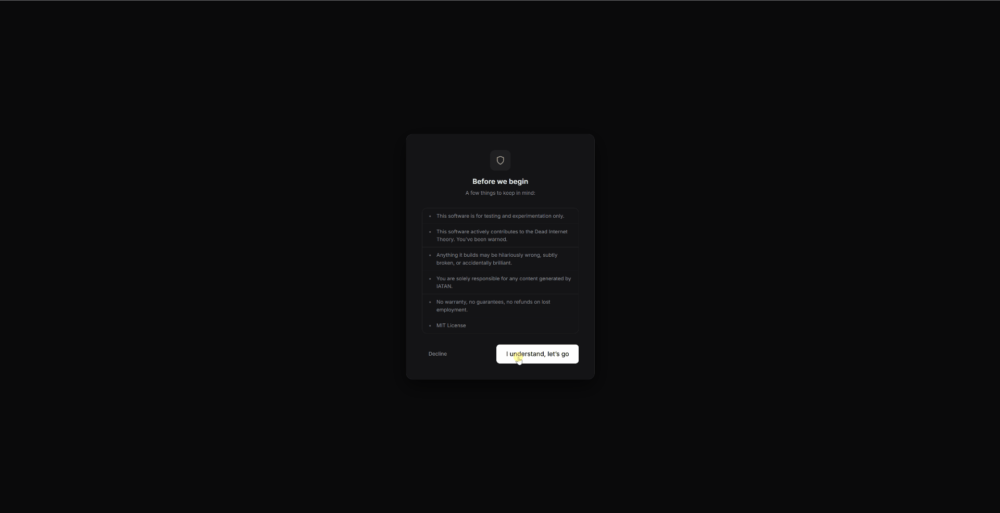

# LOOK AT ME!


# I AM THE ADMIN NOW!

---

## IATAN (I Am The Admin Now)

IATAN is a self-hosted AI platform that autonomously builds, deploys, and monitors (multiple) websites. One binary. 

It plans, designs, writes code, creates databases, sets up APIs, scheduled tasks, webhooks and reviews its own work, and keeps the site healthy, all on its own. 
Just point your domain(s) to the server IP and you're good to go, SSL is configured automatically and free (<3 Let's Encrypt / Caddy>).

No Docker. No npm. No database server. No build steps. No webserver to install. 
It works out of the box (fingers crossed :).

**IMPORTANT: This is a very early release to get feedback and ideas from the community. Erorrs WILL be there, promised! Have been mainly testing with Z.ai (GLM-5) throughout but Claude should give better results, it was just too costly for me to blow tokens during development. Also deployment on Linux has not been tested, feedback is very much welcomed.**

To see IATAN in action visit [IATAN's home](https://iamtheadminnow.com), the brain creates and maintains this as we speak.

## Features

- **Autonomous site/app building** : Describe what you want, the AI plans, designs, codes, and deploys it
- **Dynamic REST APIs** : Auto-generated CRUD endpoints with filtering, sorting, and pagination
- **User authentication** : JWT-based auth flows with role support, built by the AI on demand
- **File uploads** : Public upload endpoints with MIME type validation, size limits, and metadata tracking
- **Real-time updates (SSE)** : Live data streaming to the browser via Server-Sent Events
- **Email sending** : Provider-agnostic email with template support (SendGrid, Mailgun, Resend, SES, or any REST API)
- **Payment flows** : Generic checkout integration (Stripe, PayPal, Mollie, Square, or any provider)
- **Aggregation queries** : COUNT, SUM, AVG, MIN, MAX with GROUP BY through the public API
- **Webhooks** : Incoming and outgoing, 20+ event types, HMAC signature verification
- **Scheduled tasks** : Cron-based automation the AI sets up and manages itself
- **Service providers** : Connect any external API with stored credentials and automatic auth injection
- **Encrypted secrets** : AES-256-GCM storage for API keys and sensitive credentials
- **Multi-site/app** : Run unlimited sites from a single instance, each with its own database
- **Free HTTPS** : Embedded Caddy with automatic Let's Encrypt certificates
- **Self-healing monitoring** : Adaptive health checks that detect and fix issues autonomously

## Simple Setup



## Testimonials

> "I showed my grandma IATAN. She asked me what a website is. I said 'just click.' She now has 86 websites and a newsletter with 200,000 subscribers. She thinks she's emailing her friends."
> : Marcus, grandson

> "My cat walked across my keyboard and clicked IATAN. He now has 12 websites, a SaaS platform, and investor meetings on Tuesday."
> : Lisa, cat owner / now cat employee

> "My husband spent 2 years building his startup. I clicked IATAN once and built a better version in front of him. We are now divorced. I got the website."
> : Angela, winner

> "I used IATAN for my daughter's lemonade stand website. She now has a multinational beverage distribution platform across 40 countries. She's 9. I need a lawyer."
> : Sandra, lemonade mom


---

## Quick Start

```bash
# Linux / macOS
chmod +x ./iatan && ./iatan

# Windows
.\iatan.exe
```

Open `http://localhost:5001` : the setup wizard handles the rest in about 2 minutes.

Your site is served at `http://localhost:5000`.

---

## Download

Grab the latest release:

- **[IATAN_VX.X.X.zip](https://github.com/markdr-hue/IATAN/releases)** : contains `iatan.exe`, `config.json`, and `firstrun.json`

Unzip somewhere convenient, run `iatan.exe`, open `http://localhost:5001`.

---

## The Pipeline

Every site goes through the same deterministic build process:

| Stage | What Happens |
|---|---|
| **PLAN** | Analyzes your description, produces a JSON blueprint |
| **DESIGN** | Creates CSS, layout, SPA router |
| **DATA LAYER** | Tables, schemas, API endpoints (skipped if not needed) |
| **BUILD PAGES** | One focused LLM call per page |
| **REVIEW** | Automated validation + LLM fix cycle |
| **MONITORING** | Adaptive health checks, self-healing |

Updates use an incremental path, only the affected pages and components get rebuilt.

---

## Production HTTPS

IATAN has [Caddy](https://caddyserver.com) built into the binary. When you're ready to go live:

1. Point your domain's DNS to your server
2. Set the domain on your site in the admin panel
3. Set `IATAN_CADDY_ENABLED=true`
4. Restart

Caddy automatically gets a free SSL certificate from Let's Encrypt. No certbot, no nginx, no renewal cron jobs.

Make sure port 80 and 433 can be reached to validate the domain. See troubleshooting section for more info.

---

## Configuration

IATAN works with zero configuration. If you want to tweak things:

```bash
cp config.example.json config.json
```

Then edit `config.json`:

```json
{
  "admin_port": 5001,
  "public_port": 5000,
  "data_dir": "./data",
  "log_level": "info",
  "caddy_enabled": false,
  "cors_origins": [],
  "rate_limit_rate": 100,
  "rate_limit_burst": 200
}
```

All fields are optional, only include what you want to change. The example file (`config.example.json`) ships with the defaults.

Or use environment variables with the `IATAN_` prefix:

```bash
IATAN_ADMIN_PORT=5001
IATAN_PUBLIC_PORT=5000
IATAN_DATA_DIR=./data
IATAN_LOG_LEVEL=debug
IATAN_CADDY_ENABLED=true
```

LLM API keys are configured through the setup wizard, but you can also set them as environment variables:

```bash
ANTHROPIC_API_KEY=sk-ant-...
OPENAI_API_KEY=sk-...
GOOGLE_AI_API_KEY=...
```

Priority: environment variables > `config.json` > defaults.

---

## Build From Source

```bash
# Requires Go 1.25+
git clone https://github.com/markdr-hue/IATAN.git
cd iatan-go

make build          # Build for your platform
make build-linux    # Linux AMD64 + ARM64
make build-darwin   # macOS Intel + Apple Silicon
make build-all      # Cross-compile everything
```

---

## Architecture

```
                    You
                     |
              localhost:5001 (admin)
                     |
            +--------+--------+
            |    IATAN Core   |
            |                 |
            |  Pipeline Brain |
            |  Chat (SSE)     |
            |  Per-site SQLite|
            +--------+--------+
                     |
              localhost:5000 (public)
                     |
                  Visitors
```

- **Admin** (`:5001`) : Manage sites, chat with the brain, view logs and analytics
- **Public** (`:5000`) : Your generated sites, served to visitors
- **Brain** : One goroutine per site, channel-based commands, crash recovery
- **Database** : Main DB + per-site DBs
---

## Requirements

- An LLM API key (Anthropic, Google, z-AI or whatever you like) : or [Ollama](https://ollama.com) for fully local/free operations
- That's it

---

## Security

### Lock down the admin port

The admin panel runs on port **5001** by default. If your server's firewall allows it, **anyone on the internet can reach it**. You should block external access and use an SSH tunnel instead:

**Windows Server:**

```powershell
netsh advfirewall firewall add rule name="Block IATAN Admin" dir=in action=block protocol=tcp localport=5001
```

**Linux (ufw):**

```bash
sudo ufw deny 5001/tcp
```

Then access admin remotely through an SSH tunnel:

```bash
ssh -L 5001:localhost:5001 user@yourserver
```

Open `http://localhost:5001` on your local machine : the traffic is encrypted through SSH and the port stays closed to the outside world.

---

## Troubleshooting

### HTTPS / Let's Encrypt fails with "Timeout during connect"

Caddy needs ports **80** and **443** open for Let's Encrypt to verify your domain. Open them on your server's firewall:

**Windows Server:**

```powershell
netsh advfirewall firewall add rule name="HTTP" dir=in action=allow protocol=tcp localport=80
netsh advfirewall firewall add rule name="HTTPS" dir=in action=allow protocol=tcp localport=443
```

**Linux (ufw):**

```bash
sudo ufw allow 80/tcp
sudo ufw allow 443/tcp
```

Also check your hosting provider's control panel : many VPS providers have a separate firewall/security group that needs ports 80 and 443 allowed.

Once the ports are open, restart IATAN and Caddy will automatically retry and get the certificate.

---

## Warning

- This is for **testing and experimentation**. Not production. Probably.
- There will be errors, trust me
- It autonomously generates websites using AI, which actively contributes to the Dead Internet Theory. You've been warned.
- Anything it builds may be hilariously wrong, subtly broken, or accidentally brilliant.
- You are solely responsible for any content generated by IATAN.
- IATAN is not responsible for unemployment

---

## Community

- **Discord** : [Join the server](https://discord.gg/VRdYgDQ2qr)
- **X / Twitter** : [@GO_IATAN](https://x.com/GO_IATAN)

---

## About Me

- Full-time single dad of 3, with a full-time job to match.
- My ideas and perspective tend to be a bit unconventional, which means I'm often misunderstood or out of step with the people around me.
- I frequently question whether I see the world differently from everyone else. I've made peace with the fact that the answer is probably yes.

---

## License

MIT
